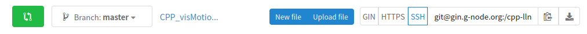

<h1 style="width: 120%"> Datalad crash course </h1>

<!-- insert datalad and crash test dummies image -->

<h2 id="TOC"> Table of content </h2>

- [Goals](#goals)
- [Prerequisites](#prerequisites)
    - [Pre-flight checks](#pre-flight-checks)
- [Install a BIDS dataset](#install-a-bids-dataset)
    - [From GIN](#from-gin)
    - [From openneuro](#from-openneuro)
    - [Install it](#install-it)
- [Try to open a “text” file](#try-to-open-a-text-file)
- [Try to open a datafile and failing](#try-to-open-a-datafile-and-failing)
- [Getting data](#getting-data)
- [Try to open a datafile and succeeding](#try-to-open-a-datafile-and-succeeding)
- [Modifying data and failing](#modifying-data-and-failing)
- [Unlocking data](#unlocking-data)
- [Modifying data and succeeding](#modifying-data-and-succeeding)
- [Saving data](#saving-data)
- [Pushing data and failing](#pushing-data-and-failing)
- [Creating a remote repo](#creating-a-remote-repo)
- [Pushing data and succeeding](#pushing-data-and-succeeding)
- [Dropping data](#dropping-data)
- [Creating a repo from scratch](#creating-a-repo-from-scratch)
- [Useful links](#useful-links)

<details><summary> <b>CLICK ME</b> </summary><br>

... to see what I hide !!!

</details>

<br>

## Goals

- be able to install a datalad dataset and work with it
- be able to create a datalad dataset and a remote copy of it online

## Prerequisites

In terms of technical knowledge, knowing some UNIX command line and some of the
Git basics might help but are not required.

But there are things you need to install and do before the workshop:

- [install datalad](http://handbook.datalad.org/en/latest/intro/installation.html)
- [create a GIN account](https://gin.g-node.org/)
- [create an SSH key](https://docs.github.com/en/authentication/connecting-to-github-with-ssh/generating-a-new-ssh-key-and-adding-it-to-the-ssh-agent)
- add it to your GIN account:
  - [see the github doc](https://docs.github.com/en/authentication/connecting-to-github-with-ssh/adding-a-new-ssh-key-to-your-github-account)
  - [see the datalad handbook](http://handbook.datalad.org/en/latest/basics/101-139-gin.html#prerequisites)
- [basic configuration](http://handbook.datalad.org/en/latest/intro/installation.html#initial-configuration)

### Pre-flight checks

Checks to make sure everything is set up correctly

In a terminal, make sure that you have a version of datalad >= 0.13

```bash
datalad --version
```

Should return something like this:

```bash
datalad 0.13.4
```

Try to install a dataset from GIN

```bash
datalad install -s git@gin.g-node.org:/cpp-lln-lab/CPP_visMotion-raw.git \
                  ~/CPP_visMotion-raw
```

The first time you do this, it will ask you some confirmation about using your
SSH key to connect to GIN. This is normal and you can safely say "yes".

But it should eventually return something like this:

```bash
install(ok): /home/remi/CPP_visMotion-raw (dataset)
```

If this install work you can remove the dataset with.

```bash
rm -rf ~/CPP_visMotion-raw
```

## Install a BIDS dataset

Choose a dataset you want to install.

### From GIN

- a
  [public fMRI dataset from our lab](https://gin.g-node.org/cpp-lln-lab/CPP_visMotion-raw)
- your own dataset from GIN: it should in a private repository you should have
  access to from the
  [CPP LLN lab organization on GIN](https://gin.g-node.org/cpp-lln-lab)

To install a dataset from GIN make sure you copy the SSH url:



### From openneuro

- a dataset from [openneuro](https://openneuro.org/)
  - Each dataset has a "download" link that will give you the datalad command to
    install it.
  - See for example this dataset:
    https://openneuro.org/datasets/ds004019/versions/1.0.0/download

### Install it

This is done with the `datalad install` command.

In its simplest form it just requires a source URL to install a dataset from.

```bash
datalad install -s ${url}
```

<details><summary> <b>What's with the dollar <code>$</code> and the curly braces <code>{}</code>?</b> </summary><br>

This is how you can call previously stored variables in bash (the language used
by default in most terminals).

</details>

<br>

So if the URL you copied is
`git@gin.g-node.org:/cpp-lln-lab/CPP_visMotion-raw.git`, then you just need to
type:

**Example**

```bash
datalad install -s git@gin.g-node.org:/cpp-lln-lab/CPP_visMotion-raw.git
```

You can also specify the folder where to install the dataset.

```bash
datalad install -s ${url} \
                  ${where_to_install}
```

**Example**

```bash
datalad install -s git@gin.g-node.org:/cpp-lln-lab/CPP_visMotion-raw.git \
                /home/remi/gin/CPP_visMotion-raw
```

## Try to open a “text” file

## Try to open a datafile and failing

## Getting data

## Try to open a datafile and succeeding

## Modifying data and failing

## Unlocking data

## Modifying data and succeeding

## Saving data

## Pushing data and failing

## Creating a remote repo

## Pushing data and succeeding

## Dropping data

## Creating a repo from scratch

## Useful links

- [Datalad handbook](http://handbook.datalad.org/en/latest/index.html)

<footer>
    <hr>
    <button><a href="#TOC">back to the top</a></button>
    <br />
    <a rel="license" href="http://creativecommons.org/licenses/by/4.0/">
        
    </a>
    <br />
    This work is licensed under a
    <a rel="license" href="http://creativecommons.org/licenses/by/4.0/">
        Creative Commons Attribution 4.0 International License
    </a>.
</footer>
