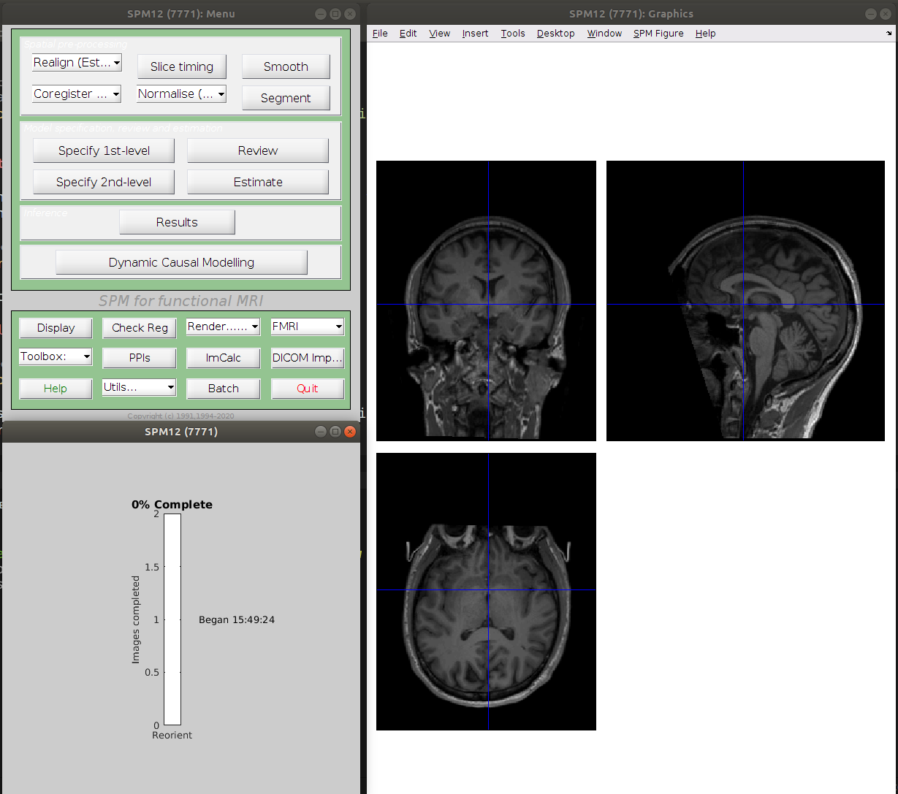

<h1 style="width: 120%"> Datalad crash course </h1>

<!-- insert datalad and crash test dummies image -->

<h2 id="TOC"> Table of content </h2>

- [Goals](#goals)
- [Prerequisites](#prerequisites)
    - [Pre-flight checks](#pre-flight-checks)
- [Install a BIDS dataset](#install-a-bids-dataset)
    - [From GIN](#from-gin)
    - [From openneuro](#from-openneuro)
    - [Install it](#install-it)
- [Try to open a “text” file](#try-to-open-a-text-file)
- [Try to open a datafile and failing](#try-to-open-a-datafile-and-failing)
- [Getting data](#getting-data)
- [Try to open a datafile and succeeding](#try-to-open-a-datafile-and-succeeding)
- [Modifying data and failing](#modifying-data-and-failing)
- [Unlocking data](#unlocking-data)
- [Modifying data and succeeding](#modifying-data-and-succeeding)
- [Saving data](#saving-data)
- [Pushing data and failing](#pushing-data-and-failing)
- [Creating a remote repo](#creating-a-remote-repo)
- [Pushing data and succeeding](#pushing-data-and-succeeding)
- [Dropping data](#dropping-data)
- [Creating a repo from scratch](#creating-a-repo-from-scratch)
- [Useful links](#useful-links)

<details><summary> <b>CLICK ME</b> </summary><br>

... to see what I hide !!!

</details>

<br>

## Goals

- be able to install a datalad dataset and work with it
- be able to create a datalad dataset and a remote copy of it online

## Prerequisites

In terms of technical knowledge, knowing some UNIX command line and some of the
Git basics might help but are not required.

But there are things you need to install and do before the workshop:

- [install datalad](http://handbook.datalad.org/en/latest/intro/installation.html)
  - for Windows, it is preferable to use the
    [Windows Subsystem Linux install](http://handbook.datalad.org/en/latest/intro/installation.html#ww-wsl2)
  - if you have a Mac M1, please check
    [this issue](https://github.com/datalad/datalad/issues/5701) for a
    workaround in case you run into problems
- [create a GIN account](https://gin.g-node.org/)
- [create an SSH key](https://docs.github.com/en/authentication/connecting-to-github-with-ssh/generating-a-new-ssh-key-and-adding-it-to-the-ssh-agent)
- add it to your GIN account:
  - [see the github doc](https://docs.github.com/en/authentication/connecting-to-github-with-ssh/adding-a-new-ssh-key-to-your-github-account)
  - [see the datalad handbook](http://handbook.datalad.org/en/latest/basics/101-139-gin.html#prerequisites)
- [basic configuration](http://handbook.datalad.org/en/latest/intro/installation.html#initial-configuration)

### Pre-flight checks

Checks to make sure everything is set up correctly

In a terminal, make sure that you have a version of datalad >= 0.13

```bash
datalad --version
```

**Example output**

```bash
datalad 0.13.4
```

Try to install a dataset from GIN

```bash
datalad install -s git@gin.g-node.org:/cpp-lln-lab/CPP_visMotion-raw.git \
                  ~/CPP_visMotion-raw
```

The first time you do this, it will ask you some confirmation about using your
SSH key to connect to GIN. This is normal and you can safely say "yes".

**Example output**

```bash
install(ok): /home/remi/CPP_visMotion-raw (dataset)
```

If this install work you can remove the dataset with.

```bash
rm -rf ~/CPP_visMotion-raw
```

## Install a BIDS dataset

Choose a BIDS dataset you want to install.

### From GIN

- a
  [public fMRI dataset from our lab](https://gin.g-node.org/cpp-lln-lab/CPP_visMotion-raw)
- your own dataset from GIN: it should in a private repository you should have
  access to from the
  [CPP LLN lab organization on GIN](https://gin.g-node.org/cpp-lln-lab)

To install a dataset from GIN make sure you copy the SSH url:


### From openneuro

- a dataset from [openneuro](https://openneuro.org/)
  - Each dataset has a "download" link that will give you the datalad command to
    install it.
  - See for example this dataset:
    https://openneuro.org/datasets/ds004019/versions/1.0.0/download

### Install it

This is done with the `datalad install` command.

In its simplest form it just requires a source URL to install a dataset from.

```bash
datalad install -s ${url}
```

<details><summary> <b>What's with the dollar <code>$</code> and the curly braces <code>{}</code>?</b> </summary><br>

This is how you can call previously stored variables in bash (the language used
by default in most terminals).

<pre>
url="git@gin.g-node.org:/cpp-lln-lab/CPP_visMotion-raw.git"
datalad install -s ${url}
</pre>

</details>

<br>

So if the URL you copied is
`git@gin.g-node.org:/cpp-lln-lab/CPP_visMotion-raw.git`, then you just need to
type:

**Example**

```bash
datalad install -s git@gin.g-node.org:/cpp-lln-lab/CPP_visMotion-raw.git
```

You can also specify the folder where to install the dataset.

```bash
datalad install -s ${url} \
                  ${where_to_install}
```

**Example**

```bash
datalad install -s git@gin.g-node.org:/cpp-lln-lab/CPP_visMotion-raw.git \
                /home/remi/gin/CPP_visMotion-raw
```

If everything went smoothly the folder structure and the files should now be on
your computer and you can browse them in your file explorer or via your
terminal.

## Try to open a “text” file

If we have a quick look at the content of our data, we can see that it contains
some plain text file like JSON or TSV.

```bash
tree -L 1 /home/remi/gin/CPP_visMotion-raw
```

**Example output**

```bash
/home/remi/gin/CPP_visMotion-raw
├── CHANGES
├── dataset_description.json
├── participants.json
├── participants.tsv
├── README
├── sub-con07
├── sub-con08
├── sub-con15
└── task-visMotion_bold.json
```

Try to open and edit one of these text files with your favorite text editor.

You can both open, modify and save that file.

## Try to open a datafile and failing

Let's try to open a file that is not "just" a text file.

In this example we could try to open a nifti image (`.nii`) with MRIcron,
fsleyes, SPM CheckReg...

If you have installed an EEG dataset you can try to load it with the tools you
usually use to quickly view those files.

```bash
tree -L 3 /home/remi/gin/CPP_visMotion-raw/sub-con07/
```

**Example output**

```bash
/home/remi/gin/CPP_visMotion-raw/sub-con07/
└── ses-01
    ├── anat
    │   ├── sub-con07_ses-01_T1w.json
    │   └── sub-con07_ses-01_T1w.nii -> ../../../.git/annex/objects/j5/G3/MD5E-s25166176--d5dec5aad67f659c2f218f096cb4b8d4.nii/MD5E-s25166176--d5dec5aad67f659c2f218f096cb4b8d4.nii
    └── func
        ├── sub-con07_ses-01_task-visMotion_bold.nii -> ../../../.git/annex/objects/mJ/PF/MD5E-s370137952--89a6190d568fa6cbb0fd1f23eb763b0c.nii/MD5E-s370137952--89a6190d568fa6cbb0fd1f23eb763b0c.nii
        └── sub-con07_ses-01_task-visMotion_events.tsv
```

Apparently fsleyes is not happy when trying to open the T1w file of an installed
dataset.


This is because even though, the file shows up on your computer its "content"
has not been downloaded on your computer. This is also why installing the whole
dataset was so quick.

## Getting data

To get the content of a file you use the `datalad get` command that must be run
from within the dataset (from a folder in the dataset).

```bash
datalad get ${path_to_the_folder_or_file}
```

```bash
cd /home/remi/gin/CPP_visMotion-raw
datalad get /home/remi/gin/CPP_visMotion-raw/sub-con07/anat/*T1w.nii
```

<details><summary> <b>What's with the star <code>*</code>?</b> </summary><br>

That's a UNIX thing to allow you to say "any sequence of characters". So in our
case that would mean any file in the <code>anat</code> folder that ends in
<code>T1w.nii</code>.

</details>

<br>

**Example output**

```bash
datalad get /home/remi/gin/CPP_visMotion-raw/sub-con07/ses-01/anat/sub-con07_ses-01_T1w.nii
Total:   0%|                                                                                                                 | 0.00/25.2M [00:00<?, ? Bytes/s]
Get sub-con07/ses-01/anat/sub-con07_ses-01_T1w.nii:  34%|████████████████████                                       | 8.58M/25.2M [00:00<00:00, 64.9M Bytes/s]
```

And eventually:

```bash
get(ok): sub-con07/ses-01/anat/sub-con07_ses-01_T1w.nii (file) [from origin...]
```

**Note**

Depending on the color highlighting of your terminal, you might see a difference
on the color of the file whose content you just got.

## Try to open a datafile and succeeding

You can now browse the actual content of that file.


## Modifying data and failing

Let's now try to something basic on this image to modify it, like reorienting it
with SPM by setting the origin of the image to the anterior commissure.

In SPM, you can open the image with the `CheckReg` tool, locate the anterior
commissure and then right click `Reorient --> Set origin to cross-hair` and then
select the images to apply this change to.

SPM will try to modify the header of the image to implement the requested and
will fail majestically in the process.



```matlab
------------------------------------------------------------------------
14-Feb-2022 15:49:23 - Running job #1
------------------------------------------------------------------------
14-Feb-2022 15:49:23 - Running 'Reorient Images'
Error: Permission denied
There was a problem writing to the header of
  "/home/remi/gin/CPP_visMotion-raw/sub-con07/ses-01/anat/sub-con07_ses-01_T1w.nii"
14-Feb-2022 15:49:24 - Failed  'Reorient Images'
Error using nifti/create (line 26)
Unable to write header for "/home/remi/gin/CPP_visMotion-raw/sub-con07/ses-01/anat/sub-con07_ses-01_T1w.nii".
In file "/home/remi/matlab/SPM/spm12/@nifti/create.m" (v7147), function "create" at line 26.
In file "/home/remi/matlab/SPM/spm12/spm_get_space.m" (v6379), function "spm_get_space" at line 51.
In file "/home/remi/matlab/SPM/spm12/config/spm_run_reorient.m" (v6078), function "spm_run_reorient" at line 33.

The following modules did not run:
Failed: Reorient Images

Error using MATLABbatch system
Job execution failed. The full log of this run can be found in MATLAB command window, starting with the lines (look for the line
showing the exact #job as displayed in this error message)
------------------
Running job #1
------------------

Error while evaluating Menu Callback.
```

The important error in there is `Error: Permission denied`.

```
ls -l sub-con07/ses-01/anat
-rwxrwxr-x 1 remi remi 2170 Feb 14 14:23 sub-con07_ses-01_T1w.json
lrwxrwxrwx 1 remi remi  139 Feb 14 14:23 sub-con07_ses-01_T1w.nii -> ../../../.git/annex/objects/j5/G3/MD5E-s25166176--d5dec5aad67f659c2f218f096cb4b8d4.nii/MD5E-s25166176--d5dec5aad67f659c2f218f096cb4b8d4.nii
```

## Unlocking data

## Modifying data and succeeding

## Saving data

## Pushing data and failing

## Creating a remote repo

## Pushing data and succeeding

## Dropping data

## Creating a repo from scratch

## Useful links

- [Datalad handbook](http://handbook.datalad.org/en/latest/index.html)
- [Datalad cheat sheet](https://raw.githubusercontent.com/datalad-handbook/artwork/master/src/datalad-cheatsheet.pdf)
- [Datalad aliases - unofficial](https://github.com/Remi-Gau/datalad_aliases)

<footer>
    <hr>
    <button style="margin: 10px"><a href="#TOC">back to the top</a></button>
    <br />
    <a rel="license" href="http://creativecommons.org/licenses/by/4.0/">
        
    </a>
    This work is licensed under a
    <a rel="license" href="http://creativecommons.org/licenses/by/4.0/">
        Creative Commons Attribution 4.0 International License
    </a>.
</footer>
