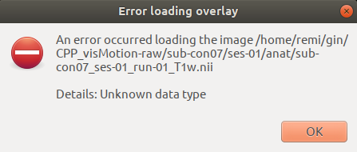
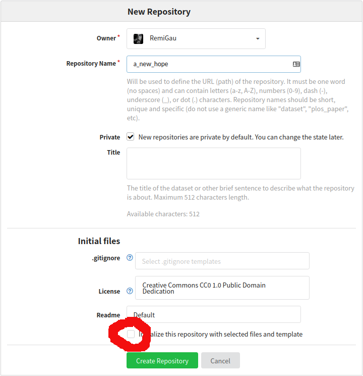
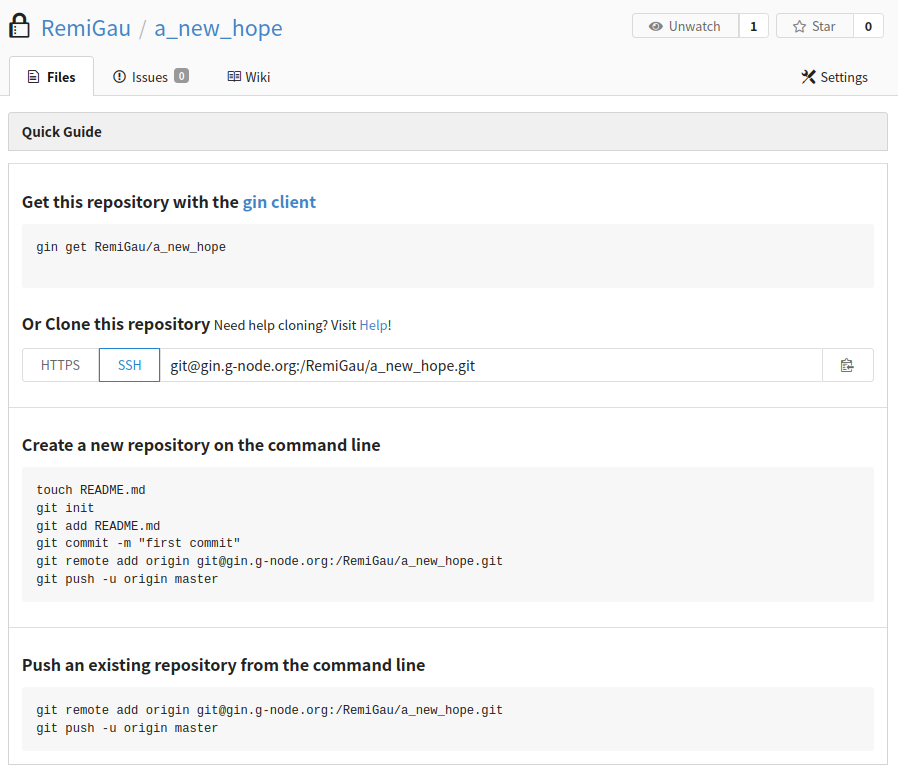

<h1 style="width: 120%"> Datalad crash course </h1>

<!-- insert datalad and crash test dummies image -->


<h2 id="TOC"> Table of content </h2>

- [Goals](#goals)
- [Prerequisites](#prerequisites)
  - [Pre-flight checks](#pre-flight-checks)
- [Install a BIDS dataset](#install-a-bids-dataset)
  - [From GIN 🍸](#from-gin-)
  - [From openneuro](#from-openneuro)
  - [Install it](#install-it)
- [Try to open a “text” file](#try-to-open-a-text-file)
- [Saving data 💾](#saving-data-)
- [Renaming a file](#renaming-a-file)
- [Try to open a datafile and failing ❌](#try-to-open-a-datafile-and-failing-)
  - [🚨 Under the hood: remote content 🚨](#-under-the-hood-remote-content-)
- [Getting data](#getting-data)
- [Try to open a datafile and succeeding ✅](#try-to-open-a-datafile-and-succeeding-)
- [Modifying data and failing ❌](#modifying-data-and-failing-)
  - [🚨 Under the hood: annexed files 🚨](#-under-the-hood-annexed-files-)
- [Unlocking data 🔓](#unlocking-data-)
- [Modifying data and succeeding ✅](#modifying-data-and-succeeding-)
- [Saving data again 💾](#saving-data-again-)
- [The history of the dataset](#the-history-of-the-dataset)
- [Pushing data and failing ❌](#pushing-data-and-failing-)
  - [🚨 Under the hood: siblings 🚨](#-under-the-hood-siblings-)
- [Creating a remote repo on GIN 🍸](#creating-a-remote-repo-on-gin-)
- [Pushing data and succeeding ✅](#pushing-data-and-succeeding-)
- [Dropping data](#dropping-data)
- [Creating a dataset from scratch](#creating-a-dataset-from-scratch)
  - [Backing it up online](#backing-it-up-online)
- [Oops! I turned my home folder into a datalad dataset... 🙈](#oops-i-turned-my-home-folder-into-a-datalad-dataset-)
  - [🚨 Under the hood: the `.git` folder 🚨](#-under-the-hood-the-git-folder-)
- [Useful tips](#useful-tips)
- [Useful links](#useful-links)

<details><summary> <b>CLICK ME</b> </summary><br>

... to see what I hide !!!

</details>

<br>

## Goals

- install a datalad dataset and work with it
- create a datalad dataset and a remote copy of it online

The examples taken here on an MRI dataset but feel free to try this on dataset
with any other type of data.

<hr>
<br>

## Prerequisites

In terms of technical knowledge, knowing some UNIX command line and some of the
Git basics might help but are not required.

But there are things you need to install and do before the workshop:

- [install datalad](http://handbook.datalad.org/en/latest/intro/installation.html)
  - for Windows, it is preferable to use the
    [Windows Subsystem Linux install](http://handbook.datalad.org/en/latest/intro/installation.html#ww-wsl2)
  - if you have a Mac M1, please check
    [this issue](https://github.com/datalad/datalad/issues/5701) for a
    workaround in case you run into problems
- [create a GIN account](https://gin.g-node.org/)
- [create an SSH key](https://docs.github.com/en/authentication/connecting-to-github-with-ssh/generating-a-new-ssh-key-and-adding-it-to-the-ssh-agent)
- add it to your GIN account:
  - [see the github doc](https://docs.github.com/en/authentication/connecting-to-github-with-ssh/adding-a-new-ssh-key-to-your-github-account)
  - [see the datalad handbook](http://handbook.datalad.org/en/latest/basics/101-139-gin.html#prerequisites)
- [basic configuration](http://handbook.datalad.org/en/latest/intro/installation.html#initial-configuration)

### Pre-flight checks

Checks to make sure everything is set up correctly

In a terminal, make sure that you have a version of datalad >= 0.13

```bash
datalad --version
```

**Example output**

```bash
datalad 0.13.4
```

Try to install a dataset from GIN

```bash
datalad install -s git@gin.g-node.org:/cpp-lln-lab/CPP_visMotion-raw.git \
                  ~/CPP_visMotion-raw
```

The first time you do this, it will ask you some confirmation about using your
SSH key to connect to GIN. This is normal and you can safely say "yes".

**Example output**

```bash
install(ok): /home/remi/CPP_visMotion-raw (dataset)
```

If this install works, you can remove the dataset with.

```bash
rm -rf ~/CPP_visMotion-raw
```

<hr>
<br>

## Install a BIDS dataset

Choose a BIDS dataset you want to install.

### From GIN 🍸

- a
  [public fMRI dataset from our lab](https://gin.g-node.org/cpp-lln-lab/CPP_visMotion-raw)
- your own dataset from GIN: it should be in a private repository you should
  have access to in the
  [CPP LLN lab organization on GIN](https://gin.g-node.org/cpp-lln-lab)

To install a dataset from GIN make sure you copy the SSH url:


### From openneuro

- a dataset from [openneuro](https://openneuro.org/)
  - Each dataset has a "download" link that will give you the datalad command to
    install it.
  - See for example
    [this dataset](https://openneuro.org/datasets/ds004019/versions/1.0.0/download)

### Install it

This is done with the `datalad install` command.

In its simplest form it just requires a source URL to install a dataset from.

```bash
datalad install -s ${url}
```

<details><summary> <b>What's with the dollar <code>$</code> and the curly braces <code>{}</code>?</b> </summary><br>

This is how you can call previously stored variables in bash (the language used
by default in most terminals).

<pre>
url="git@gin.g-node.org:/cpp-lln-lab/CPP_visMotion-raw.git"
datalad install -s ${url}
</pre>

</details>

<br>

So if the URL you copied is
`git@gin.g-node.org:/cpp-lln-lab/CPP_visMotion-raw.git`, then you just need to
type:

**Example**

```bash
datalad install -s git@gin.g-node.org:/cpp-lln-lab/CPP_visMotion-raw.git
```

You can also specify the folder where to install the dataset.

```bash
datalad install -s ${url} \
                  ${where_to_install}
```

**Example**

```bash
datalad install -s git@gin.g-node.org:/cpp-lln-lab/CPP_visMotion-raw.git \
                ~/gin/CPP_visMotion-raw
```

If everything went smoothly the folder structure and the files should now be on
your computer and you can browse them in your file explorer or via your
terminal.

<hr>
<br>

## Try to open a “text” file

If we have a quick look at the content of our data, we can see that it contains
some plain text file like the README, or some JSON or TSV.

**Example**

```bash
cd ~/gin/CPP_visMotion-raw
tree -L 1
```

<details><summary> <b>What's this <code>tree 🌳</code> command?</b> </summary><br>

See this
<a href="http://handbook.datalad.org/en/latest/basics/101-102-populate.html#f1">footnote</a>
in case you don't have it.

</details>

<br>

**Example output**

```bash
.
├── CHANGES
├── dataset_description.json
├── participants.json
├── participants.tsv
├── README
├── sub-con07
├── sub-con08
├── sub-con15
└── task-visMotion_bold.json
```

Try to open and edit one of these text files with your favorite text editor: for
example adding some details in the README (there are rarely enough details in
those anyway).

You see you can open, modify and save that file.

<hr>
<br>

## Saving data 💾

Now let's see what datalad says about the status of our dataset.

```bash
datalad status
```

**Example output**

```bash
 modified: README (file)
```

When you want to save the changes you made to a dataset, simply use the
`datalad save` command.

You should also add a specific message to your save, to describe the content of
the save.

Here are some
[tips on how to write good save messages](http://handbook.datalad.org/en/latest/basics/101-102-populate.html#fom-commit-message-guidance).

Note that "saves" are often referred to as "commits" and that are thus
accompanied by a "commit message".

**Example**

```bash
datalad save -m 'Update README'
```

**Example output**

```bash
add(ok): README (file)
save(ok): . (dataset)
action summary:
  add (ok: 1)
  save (ok: 1)
```

<details><summary> <b>How often should I save? What should I save?</b> </summary><br>

Note that you can save specific files only with datalad

<pre style="margin-bottom: 10px">
  datalad save -m ${your_message} ${path_to_file_or_folder_to_save}
</pre>

An advice that you might hear is:

<blockquote style="margin-bottom: 10px">
  Commit early. Commit often. A version control advice, not a relationship advice.
</blockquote>

More serious advices can be found in the
<a href="https://the-turing-way.netlify.app/reproducible-research/vcs/vcs-git-compare.html#good-practice" target="_blank">Turing
way book</a>

</details>

<br>

<details><summary> <b>For the GIT users out there...</b> </summary><br>

<p>
  Datalad does not have what is called a "staging area" in GIT. So there is no
  need to "add" a file before it can be committed. More info on this
  <a href="http://handbook.datalad.org/en/latest/basics/101-180-FAQ.html#where-is-git-s-staging-area-in-datalad-datasets" target="_blank">here.</a>
</p>

<p>
  Even though you CAN use the typical holy trinity of git commands (<code>git
  add</code> / <code>git commit</code> / <code>git push</code>) when working
  within a Datalad dataset, I would recommended using typical Datalad command like
  <code>datalad save</code>, unless you are sure of what you are doing.
</p>

<p>
  However it should be completely fine to use Datalad commands within a pure git
  repository.
</p>

</details>

<br>

## Renaming a file

Now let's rename one of our non-text file and see how that goes.

This can be done via your usual file explorer or via the terminal with the move
command (`mv`).

```bash
mv -v sub-con07/ses-01/anat/sub-con07_ses-01_T1w.nii sub-con07/ses-01/anat/sub-con07_ses-01_run-01_T1w.nii
```

**Example output**

```bash
renamed 'sub-con07/ses-01/anat/sub-con07_ses-01_T1w.nii' -> 'sub-con07/ses-01/anat/sub-con07_ses-01_run-01_T1w.nii'
```

OK that seems to work. So let's save that change too.

```bash
datalad save -m 'Rename anat subject con07'
```

**Example output**

```bash
delete(ok): sub-con07/ses-01/anat/sub-con07_ses-01_T1w.nii (file)
add(ok): sub-con07/ses-01/anat/sub-con07_ses-01_run-01_T1w.nii (file)
save(ok): . (dataset)
action summary:
  add (ok: 1)
  delete (ok: 1)
  save (ok: 1)
```

<hr>
<br>

## Try to open a datafile and failing ❌

Let's try to open a file that is not "just" a text file.

In this example we could try to open a nifti image (`.nii`) with MRIcron,
fsleyes, SPM CheckReg...

If you have installed an EEG dataset you can try to load it with the tools you
usually use to quickly view those files.

Apparently fsleyes is not happy when trying to open the T1w file of an installed
dataset.



### 🚨 Under the hood: remote content 🚨

This is because even though, the file shows up on your computer its "content"
has not been downloaded on your computer.

As one of our lab member once said:

> `datalad install` gives you bunch of "ghost fileS" 👻🗄️ that have the right
> shape but no substance.

This is also why installing the whole dataset was so quick: very little data was
actually downloaded.

To fix this issue, we must get the content from where the dataset was installed.

<hr>
<br>

## Getting data

To get the content of a file you use the `datalad get` command that must be run
from within the dataset (from a folder in the dataset).

```bash
datalad get ${path_to_the_folder_or_file}
```

**Example**

```bash
datalad get sub-con07/anat/*T1w.nii
```

<details><summary> <b>What's with the star <code>*</code>?</b> </summary><br>

That's a bash thing to allow you to say "any sequence of characters". So in our
case that would mean any file in the <code>anat</code> folder that ends in
<code>T1w.nii</code>.

More on bash "globbing"
<a href="https://linuxhint.com/bash_globbing_tutorial/" target="_blank">here</a>

</details>

<br>

**Example output**

```bash
Total:   0%|                                                                                    | 0.00/25.2M [00:00<?, ? Bytes/s]
Get sub-con07/ses-01/anat/sub-con07_ses-01_run-01_T1w.nii:  34%|████████                        | 8.58M/25.2M [00:00<00:00, 64.9M Bytes/s]
```

And eventually:

```bash
get(ok): sub-con07/ses-01/anat/sub-con07_ses-01_run-01_T1w.nii (file) [from origin...]
```

**Note**

Depending on the color highlighting of your terminal, you might even see a
difference on the color of the file whose content you just got.

## Try to open a datafile and succeeding ✅

You can now browse the actual content of that file.


<hr>
<br>

## Modifying data and failing ❌

Let's now try to something basic on this image to modify it, like reorienting it
with SPM by setting the origin of the image to the anterior commissure.

In SPM, you can open the image with the `CheckReg` tool, locate the anterior
commissure and then right click `Reorient --> Set origin to cross-hair` and then
select the images to apply this change to.

SPM will try to modify the header of the image to implement the requested change
and will _fail majestically_ in the process.


```matlab
------------------------------------------------------------------------
14-Feb-2022 15:49:23 - Running job #1
------------------------------------------------------------------------
14-Feb-2022 15:49:23 - Running 'Reorient Images'
Error: Permission denied
There was a problem writing to the header of
  "/home/remi/gin/CPP_visMotion-raw/sub-con07/ses-01/anat/sub-con07_ses-01_run-01_T1w.nii"
14-Feb-2022 15:49:24 - Failed  'Reorient Images'
Error using nifti/create (line 26)
Unable to write header for "/home/remi/gin/CPP_visMotion-raw/sub-con07/ses-01/anat/sub-con07_ses-01_run-01_T1w.nii".
In file "/home/remi/matlab/SPM/spm12/@nifti/create.m" (v7147), function "create" at line 26.
In file "/home/remi/matlab/SPM/spm12/spm_get_space.m" (v6379), function "spm_get_space" at line 51.
In file "/home/remi/matlab/SPM/spm12/config/spm_run_reorient.m" (v6078), function "spm_run_reorient" at line 33.

The following modules did not run:
Failed: Reorient Images

Error using MATLABbatch system
Job execution failed. The full log of this run can be found in MATLAB command window, starting with the lines (look for the line
showing the exact #job as displayed in this error message)
------------------
Running job #1
------------------

Error while evaluating Menu Callback.
```

The important error in there is `Error: Permission denied`.

However if we check the file permissions with our file explorer / finder (or
with the terminal with the list command `ls -l`), we can see that we have "write
access" to all of these files. And yet we can edit the simple "text" file and
not the non "text" data.

**Example**

```bash
ls -l sub-con07/ses-01/anat
```

**Example output**

```bash
-rwxrwxr-x 1 remi remi 2170 Feb 14 14:23 sub-con07_ses-01_T1w.json
lrwxrwxrwx 1 remi remi  139 Feb 14 14:23 sub-con07_ses-01_run-01_T1w.nii -> ../../../.git/annex/objects/j5/G3/MD5E-s25166176--d5dec5aad67f659c2f218f096cb4b8d4.nii/MD5E-s25166176--d5dec5aad67f659c2f218f096cb4b8d4.nii
```

The `rwxrwxrwx` at the beginning of these lines defines if we have read (`r`),
write (`w`), execute (`x`) rights on those files. More on unix file permission
[here](https://www.tutorialspoint.com/unix/unix-file-permission.htm).

### 🚨 Under the hood: annexed files 🚨

We cannot edit this file, because its content has been "annexed".

You can usually tell a file is annexed when listing it in a terminal with
`ls -l` or when viewing it with `tree`.

```bash
lrwxrwxrwx 1 remi remi  139 Feb 14 14:23 sub-con07_ses-01_run-01_T1w.nii -> ../../../.git/annex/objects/j5/G3/MD5E-s25166176--d5dec5aad67f659c2f218f096cb4b8d4.nii/MD5E-s25166176--d5dec5aad67f659c2f218f096cb4b8d4.nii
```

- the `l` means that the file you are looking at is a "link"
- the `->` at the end shows what this links to: in this case a file in the
  `.git/annex` in the root of the dataset
- the file size (the 5th column on the `ls` output above) is usually a hint that
  the content of that file has been annexed: in this case the "size" of this
  nifti image is less than that a very simple JSON file (which sounds unlikely
  if the content were not annexed).

A hand wavy explanation of this annexation behavior is that Datalad in fact acts
a bit as as "a wrapper" around:

1. `git` that is good for version controlling text based files (like code, TSV,
   JSON, ...) but start struggling with non-text files and large number of files
2. `git-annex` that helps for the version control of data files.

To be able to edit this file, we must first unlock it.

<hr>
<br>

## Unlocking data 🔓

This is done with the `datalad unlock` command.

```bash
datalad unlock ${path_to_the_folder_or_file}
```

So in our case:

**Example**

```bash
datalad unlock sub-con07/ses-01/anat/*T1w.nii
```

**Example output**

```bash
unlock(ok): sub-con07/ses-01/anat/sub-con07_ses-01_run-01_T1w.nii (file)
```

The result of unlocking the file will be visible in different ways.

On a `tree` or a `ls` command, it won't show as a link but as an "actual" file.

**Example**

```bash
tree -L 3 sub-con07
```

**Example output**

```bash
sub-con07
└── ses-01
    ├── anat
    │   ├── sub-con07_ses-01_T1w.json
    │   └── sub-con07_ses-01_run-01_T1w.nii
    └── func
        ├── sub-con07_ses-01_task-visMotion_bold.nii -> ../../../.git/annex/objects/mJ/PF/MD5E-s370137952--89a6190d568fa6cbb0fd1f23eb763b0c.nii/MD5E-s370137952--89a6190d568fa6cbb0fd1f23eb763b0c.nii
        └── sub-con07_ses-01_task-visMotion_events.tsv
```

Also an `ls -l` would now show you the actual actual size of this file.

If you use the `datalad status` command, datalad will tell that this file has
been modified because it was taken out of the annex.

**Example output**

```bash
 modified: sub-con07/ses-01/anat/sub-con07_ses-01_run-01_T1w.nii (file)
```

<hr>
<br>

## Modifying data and succeeding ✅

Now let's try to modify this file again.

This time SPM seems happy.

```matlab
------------------------------------------------------------------------
14-Feb-2022 21:17:17 - Running job #1
------------------------------------------------------------------------
14-Feb-2022 21:17:17 - Running 'Reorient Images'
14-Feb-2022 21:17:18 - Done    'Reorient Images'
14-Feb-2022 21:17:18 - Done
```

Now let's see what datalad says about the status of our dataset.

```bash
datalad status
```

**Example output**

```matlab
untracked: sub-con07/ses-01/anat/sub-con07_ses-01_run-01_T1w_reorient.mat (file)
 modified: sub-con07/ses-01/anat/sub-con07_ses-01_run-01_T1w.nii (file)
```

Now datalad tells us about the files that have been modified and also about the
new file created by SPM.

<hr>
<br>

## Saving data again 💾

**Example**

```bash
datalad save -m 'setting origin to anterior commissure for subject 07'
```

**Example output**

```bash
add(ok): sub-con07/ses-01/anat/sub-con07_ses-01_T1w_reorient.mat (file)
add(ok): sub-con07/ses-01/anat/sub-con07_ses-01_run-01_T1w.nii (file)
save(ok): . (dataset)
action summary:
  add (ok: 2)
  save (ok: 1)
```

Note that saving a file, relocks it in the annex.

```bash
tree -L 3 sub-con07/anat
```

**Example output**

```bash
sub-con07/ses-01/anat
├── sub-con07_ses-01_T1w.json
├── sub-con07_ses-01_run-01_T1w.nii -> ../../../.git/annex/objects/VK/WP/MD5E-s25166176--f4db32e160f289d5cc01d3a23aadf4d0.nii/MD5E-s25166176--f4db32e160f289d5cc01d3a23aadf4d0.nii
└── sub-con07_ses-01_T1w_reorient.mat -> ../../../.git/annex/objects/68/79/MD5E-s312--85774df306f765822b4c203bca41bb13.mat/MD5E-s312--85774df306f765822b4c203bca41bb13.mat
```

See also how the new `.mat` file was annexed as well.

<hr>
<br>

## The history of the dataset

You can check all the past changes that have been made to the dataset with the
`git log` command. Type `q` to exit this "log mode".

If you want a less verbose version of the log: `git log --oneline`.

```bash
097059d (HEAD -> master) setting origin to anterior commissure for subject 07
c4a039e Rename anat subject con07
8c82a0f Update README
b003e21 (origin/master, origin/HEAD) initial save
2a72d36 Instruct annex to add text files to Git
52c0844 [DATALAD] new dataset
```

Given that more advanced usage of datalad allow you to "travel in time" 🕥🔄
through the history of a dataset to see what it looked like at a given commit,
you can quickly imagine that having good commit messages helps you knowing what
is your "best destination".


<hr>
<br>

## Pushing data and failing ❌

Now that we have made a change we want to back it up online to make sure it is
not lost in case our computer catches on fire. 💻🔥

```bash
datalad push --to ${sibling_name}
```

When you install a dataset from somewhere, the dataset that lives on your
computer is usually called the local copy (when you talk to another human being)
or the local clone (when you talk to a git user) or a local
[sibling](http://handbook.datalad.org/en/latest/glossary.html?highlight=sibling#term-sibling)
(when you talk to a datalad user). The sibling you installed from is usually
called a remote sibling and often nicknamed `origin`.

So to update the `origin` with our changes we would do:

**Example**

```bash
datalad push --to origin
```

Odds are that, unless you are the owner of the `origin` sibling, you encountered
an error that prevented from updating the online dataset.

### 🚨 Under the hood: siblings 🚨

Very often you won't have the write access to make changes to the repository
where you got a dataset from.

If however you wanted to keep track of your own changes, you can have your own
copy of that dataset on GIN by creating a
[sibling](http://handbook.datalad.org/en/latest/glossary.html?highlight=sibling#term-sibling)
repository on GIN.

The good news is that **unless the data owner has given you the right to do
so**, it is extremely unlikely you will break or destroy someone else's data.

<hr>
<br>

## Creating a remote repo on GIN 🍸

So let's create a repository on GIN.


To make your life easier do not initialize any file in this repository.



You must then copy the SSH URL.



You then need to let your local sibling that there is another repository. This
is done with the `datalad siblings add` command.

```bash
datalad siblings add --name ${name} --url ${url}
```

**Example**

```bash
datalad siblings add --name a_new_hope --url git@gin.g-node.org:/RemiGau/a_new_hope.git
```

**Example output**

```bash
[INFO   ] Could not enable annex remote a_new_hope. This is expected if a_new_hope is a pure Git remote, or happens if it is not accessible.
[WARNING] Could not detect whether a_new_hope carries an annex. If a_new_hope is a pure Git remote, this is expected.
.: a_new_hope(-) [git@gin.g-node.org:/RemiGau/a_new_hope.git (git)]
```

<hr>
<br>

## Pushing data and succeeding ✅

You should now be able to push your changes to this new sibling.

```bash
datalad push --to a_new_hope
```

**Example output**

```bash
Transfer data to 'a_new_hope':  50%|██████████████████████▌                                  | 2.00/4.00 [00:00<00:00, 8.36k Steps/s]
Total:   0%|                                                                                 | 0.00/1.17G [00:00<?, ? Bytes/s]
Copy sub-con07/ses-01/anat/sub-con07_ses-01_run-01_T1w.nii:  54%|██████████████▏             | 13.7M/25.2M [00:09<00:07, 1.62M Bytes/s]
```

And eventually:

```bash
copy(ok): sub-con07/ses-01/anat/sub-con07_ses-01_run-01_T1w.nii (file) [to a_new_hope...]
copy(ok): sub-con07/ses-01/anat/sub-con07_ses-01_run-01_T1w_reorient.mat (file) [to a_new_hope...]
publish(ok): . (dataset) [refs/heads/git-annex->a_new_hope:refs/heads/git-annex e2c7f02..0a33ba9]
publish(ok): . (dataset) [refs/heads/master->a_new_hope:refs/heads/master [new branch]]
action summary:
  copy (ok: 2)
  publish (ok: 2)
```

If you now refresh the web page of your GIN repository, it should display the
content of your data set.

<details><summary> <b>My repo in GIN looks nothing like what I have on my computer!!</b> </summary><br>

This might be because you are actually viewing the annexed content of your
dataset that lives on the "git-annex branch":
<a href="http://handbook.datalad.org/en/latest/basics/101-180-FAQ.html#help-why-does-github-display-my-dataset-with-git-annex-as-the-default-branch" target="_blank">click
here to see how to fix it</a> (the fix relates to GitHub repositories but works
on GIN too).

</details>

<br>

Note however that your remote siblings contains the content for the data you had
in your local sibling.

You can use the `git annex list` to know where you have copy of what

**Example**

```bash
git annex list .
```

**Example output**

```
here
|a_new_hope
||origin
|||web
||||bittorrent
|||||
XXX__ sub-con07/ses-01/anat/sub-con07_ses-01_run-01_T1w.nii
XX___ sub-con07/ses-01/anat/sub-con07_ses-01_run-01_T1w_reorient.mat
__X__ sub-con07/ses-01/func/sub-con07_ses-01_task-visMotion_bold.nii
__X__ sub-con08/ses-01/anat/sub-con08_ses-01_T1w.nii
__X__ sub-con08/ses-01/func/sub-con08_ses-01_task-visMotion_bold.nii
__X__ sub-con15/ses-01/anat/sub-con15_ses-01_T1w.nii
__X__ sub-con15/ses-01/func/sub-con15_ses-01_task-visMotion_bold.nii
```

So if you wanted to make an entire copy of the original dataset you would to
`get` that content first from the `origin` and then `push` it to the new one.

```bash
datalad get .
datalad push --to a_new_hope
```

We are not going to do that now, otherwise we are going to be at this until the
cows come home. 🐮 ➡️ 🏠

<hr>
<br>

## Dropping data

Sometimes our dataset get big and we usually start transferring them (or part of
them) on external hard drives and then we start having to keep track of which
file is backed up where, when was the back up done.

Then we get told we need several back ups in different locations, so now we have
to track several copies of the same dataset and make sure that they are all in
synch with each other.

Datalad allows you to keep a local copy of your data and to keep your different
back up (as siblings) synched. But if you need to make some space on your
computer without having to delete a dataset, Datalad also allows you to drop the
content of files locally.

Conceptually this is a bit like the opposite of the `datalad get` command we saw
earlier that would get the content of file from a sibling.

`datalad drop` will instead remove the content of a file from the annex provided
that this content exists in another sibling.

To know how much data exists in your annex currently you can use
`datalad status --annex all`.

**Example output**

```bash
7 annex'd files (24.0 MB/1.1 GB present/total size)
nothing to save, working tree clean
```

You can then drop the content of specific files.

```bash
datalad drop ${path_to_file}
```

The nuclear option 💥☢️ is to drop the entire dataset.

**Example**

```bash
datalad drop .
```

The `.` is NOT a typo but means "this folder". A bit like `..` means the parent
folder of where we are now.

**Example output**

```bash
drop(ok): /home/remi/gin/CPP_visMotion-raw/sub-con07/ses-01/anat/sub-con07_ses-01_run-01_T1w.nii (file) [locking a_new_hope...]
drop(ok): /home/remi/gin/CPP_visMotion-raw/sub-con07/ses-01/anat/sub-con07_ses-01_run-01_T1w_reorient.mat (file) [locking a_new_hope...]
action summary:
  drop (notneeded: 20, ok: 2)
```

<hr>
<br>

## Creating a dataset from scratch

> OK that's cool and all to be a data consumer and get data from somewhere else
> and modify it. But during my PhD I will acquire new data. So how do I start a
> Datalad dataset from scratch?

To do that you must first create an empty dataset to provide a home for your
data. This can be done with the `datalad create` command.

```bash
datalad create ${name_of_the_dataset}
```

This will create a new folder and initialize a Datalad dataset in it.

> What if I already have a folder with my data and I want to create a dataset in
> there?

For example

```bash
cd ~/gin/raw
tree -d
```

**Example output**

```bash
.
└── sub-001
    ├── ses-01
    │   ├── anat
    │   └── func
    └── ses-02
        └── func
```

In this case...


```bash
datalad create --force .
```

**Example output**

```bash
[INFO   ] Creating a new annex repo at /home/remi/gin/raw
create(ok): /home/remi/gin/raw (dataset)
```

### Backing it up online

The following steps are things that we have seen in the previous steps. So
that's easy peasy, lemon squeezy 🗜️🍋 OK... sort of lemon squeezy... I very
often have to look those up to make sure I don't mess anything.

1. `datalad save -m 'save all my data'`
1. Create an online repository on GIN
1. `datalad siblings add --name origin --url ${url}`
1. `datalad push --to origin`

Grab a coffee and look at that progress bar go! 🚀

<!--
## In the next episodes

- updating a local dataset if the origin has changed
- nesting datasets
- configuration, branches
-->

<hr>
<br>

## Oops! I turned my home folder into a datalad dataset... 🙈

> **It happened so quickly!** `#TrueStory`

🚨 DON'T TRY THIS AT HOME 🚨

```bash
# when not given any argument
# the "change directory" command will bring you to your home folder
cd

# if you now force create a datalad dataset,
# you are basically telling datalad to version control your whole home folder
datalad create --force .
```

Imagine you typed the 2 commands above. Now datalad wants to track all the files
in your computer.

FYI: if by any chance you were planning to use datalad to back up you computer,
there are better tools for this.

More seriously. How to fix this?

OK that gives us the occasion to do a shallow dive into the plumbings of
Datalad. 🕵️‍♀️

### 🚨 Under the hood: the `.git` folder 🚨

Basically all the history of your Datalad dataset is store in the hidden folder
`.git` that lives in the root of your dataset.

Additionally, data that has been annexed AND locked is stored in `.git/annex`.

Note that you might need to change some settings in your file explorer / finder
to be able to see hidden folders, in a terminal you can see those folders by
using `ls -a`).

So if you have created a Datalad dataset in the wrong place, you can simply
delete the `.git` and `.datalad` folders. **HOWEVER** if you have already saved
some data in that dataset, make sure you unlock it before removing the folder
otherwise you will lose the data.

If you want an hour long deep dive on the content of the `.git` folder,
[check this video](https://www.youtube.com/watch?v=gdY_RpY2oyU).

## Useful tips

If you don't remember the specifics of a command, type the name of that command
followed by `--help`. For example `datalad create --help`.

More
[info on how to get help](http://handbook.datalad.org/en/latest/basics/101-135-help.html).

## Useful links

- [Datalad handbook](http://handbook.datalad.org/en/latest/index.html)
  - Read at least the 2 first chapters. This will save from a lot of pain and
    confusion.
- [Datalad cheat sheet](https://raw.githubusercontent.com/datalad-handbook/artwork/master/src/datalad-cheatsheet.pdf)
- [Datalad research data management course](https://psychoinformatics-de.github.io/rdm-course/)
- [Basic file system operations with Datalad](http://handbook.datalad.org/en/latest/basics/101-136-filesystem.html)
- [Datalad aliases - unofficial](https://github.com/Remi-Gau/datalad_aliases)

<footer>
    <hr>
    <br />
    <button style="margin-bottom: 10px"><a href="#TOC">back to the top</a></button>
    <br />
    <a rel="license" href="http://creativecommons.org/licenses/by/4.0/">
        
    </a>
    <br />
    This work is licensed under a
    <a rel="license" href="http://creativecommons.org/licenses/by/4.0/">
    Creative Commons Attribution 4.0 International License
    </a>.
</footer>
